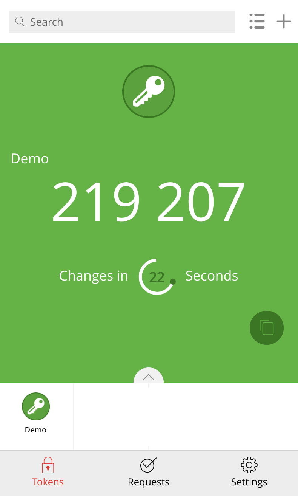

## Authenticator API

### Important
This code must not be used in production. It is an example of an authenticator API that you can use for demos or prototypes.

### API Usage

This repo contains an authenticator API that can be used as an MFA (Multi-Factor Authentication) service.
The nodeJS code uses [Loopback](https://loopback.io/doc/index.html) (v3) an Open Source API framework.

Once deployed, you can access it through:

http://HOSTNAME_OR_IP:3000/v1/mfa/authenticators

The 2 default authenticators are presented in the JSON response:

```
[{"account":"My Favorite Bank","issuer":"myBank","key":"ftww joiy vibm kztx xuk4 wj5w 22ey pnos"},
{"account":"My Other Authenticator","issuer":"other","key":"ftww joiy vibm kztx xuk4 wj5w 22ey pnos"}]
```

You can create your own authenticator through the ```./server/data/data.json``` file or using the dedicated POST requests...

The 2 authenticators use the same **private key** 

You can register this private key in [Google Authenticator](https://play.google.com/store/apps/details?id=com.google.android.apps.authenticator2&hl=en&gl=US) or Twilio Authy, for instance.

Here is an example with Twilio Auhty:



Each autthenticator creates a 6-digit code that is valid during 30 seconds.

Using the API based on the nodeJS code that is provided, you can create a 6-digit verification code, using the following resource:

http://HOSTNAME_OR_IP:3000/v1/mfa/authenticators/{issuer}/code

- where {issuer} is the issuer (possible value are "other" or "myBank")

...and verify the 6-digit code that has been generated, using:

http://HOSTNAME_OR_IP:3000/v1/mfa/authenticators/{issuer}/code/{6-digit-code}

- where {6-digit-code} is the code that has been generated and that is valid for 30 seconds...

If the code is valid, the response is the following JSON content:

```
{"delta":0}
```
or:
```
{"delta":-1}
```
"-1" means that the code is about to expire...

If the code has expired or is wrong, then the JSON content is the following:

```
{"delta":"error", "message":"code not verified"}
```
